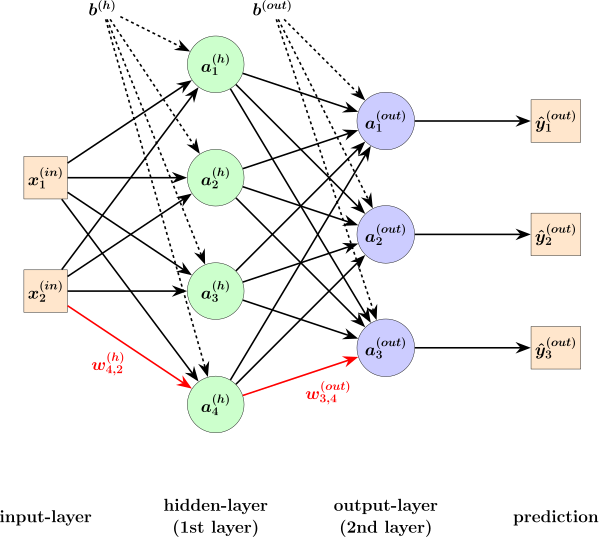

# State of Charge (SOC) Estimation Using Machine Learning

## 📊 **Project Overview**
This project focuses on the estimation of the State of Charge (SOC) for lithium-ion batteries using machine learning techniques. It utilizes multiple features such as current, voltage, and temperature to predict SOC accurately.

---

## 🚀 **Dataset and Features**
 

- **Features Used:**
    - `I_avg`: Average current
    - `V_avg`: Average voltage
    - `Temp`: Temperature
    - `SOC`: State of charge (target variable)

   
   
   

**Data Preprocessing:**
    - Normalization and standardization of the input features.
    - Splitting the data into training and testing sets.
    - Handling missing values and outliers.

- ## **📉 Time Series Plots:**
   
   
   

---

## 🔥 **Modeling and Evaluation**
### Metrics used for Models Evaluation

This list will be used later to evaluate trained models metrics. Specifically, the metrics used for models evaluation are:

- **Max Error:**  

 $$\text{Max Error} = \max_i |Y_i - \hat{Y_i}|$$ 

- **Mean Absolute Error (MAE):**  

 $$\text{MAE} = \frac{1}{n} \sum_{i=1}^{n} |Y_i - \hat{Y_i}|$$ 

- **Mean Absolute Percentage Error (MAPE):**  

 $$\text{MAPE} = 100 \cdot \frac{1}{n} \sum_{i=1}^{n} \left( \frac{|Y_i - \hat{Y_i}|}{Y_i} \right)$$ 

- **Mean Squared Error (MSE):**  

 $$\text{MSE} = \frac{1}{n} \sum_{i=1}^{n} (Y_i - \hat{Y_i})^2$$ 

- **Root Mean Squared Error (RMSE):**  

 $$\text{RMSE} = \sqrt{\frac{1}{n} \sum_{i=1}^{n} (Y_i - \hat{Y_i})^2}$$ 

- **Root Mean Squared Log Error (RMSLE):**  

 $$\text{RMSLE} = \sqrt{\frac{1}{n} \sum_{i=1}^{n} \left( \log(1 + Y_i) - \log(1 + \hat{Y_i}) \right)^2}$$ 

<!-- 
 -->

---
- ## **Algorithms Used:**
    <!-- - Linear Regression -->

    ### Linear Regression

    **Linear Regression** aims to establish a **linear relationship** between a dependent variable  \( y \) and one or more independent variables \( x \).  
    In other words, the model attempts to find a **linear function** that improves the prediction of \( y \) given \( x \).  

    #### Goal:
    - The objective of Linear Regression is to find the **coefficient values** that **minimize the sum of squares of the errors**, i.e., the difference between the observed values and the predicted values by the model.

    #### Mathematical Representation:
    $$y = \beta_0 + \beta_1 x_1 + \beta_2 x_2 + \dots + \beta_n x_n + \epsilon \ $$
    
    <!--  -->
    #### Visualization:
    
    - **Observed vs Predicted**
      

    ### Decision Tree Regression

    **Decision Tree Regression** is a **Machine Learning technique** that uses **tree structures** to model the relationship between **independent variables** and a **dependent variable**.  

    #### Structure:
    - A **Decision Tree** consists of:
        - **Intermediate nodes**: Split the dataset into subgroups based on specific conditions.  
        - **Branches**: Represent the possible choices leading to the next nodes.  
        - **Leaf nodes**: Provide the **final prediction** value.  

    #### Splitting Criterion:
    - At each node, the dataset is split to minimize the **mean squared error (MSE)** or another metric.
    - The formula for **MSE** at a node is:
  
  
    
 $$\text{MSE} = \frac{1}{n} \sum_{i=1}^{n} (y_i - \hat{y})^2\$$ 

        
        <!--  -->
        - $n$→ Number of samples at the node  
        - $y_i$ → Actual values  
        - $\hat{y}$ → Predicted value  
  

    #### Prediction Formula:
    - The predicted value at a **leaf node** is the **average** of the target values in that region:
    $$\hat{y} = \frac{1}{n} \sum_{i=1}^{n} y_i$$
    <!--  -->

    #### Visualization:

  

  - **Observed vs Predicted**
      

    ### K-Nearest Neighbors Regression

    **K-Nearest Neighbors Regression (KNN)** is a **Machine Learning technique** used for **regression problems**.  
    
    #### How it Works:
    1. **Problem Definition:**  
        - Start with a dataset containing **independent variables (features)** and a **numeric dependent variable (target)**.  
        - The goal is to predict the value of the **target** for new data points.  
    
    2. **Neighbor Selection:**  
        - For a new data point, **KNN regression** identifies the \( K \) closest points in the training dataset.  
        - Distance is typically calculated using **Euclidean distance**:

            

    
    3. **Aggregation of Results:**  
        - The predicted value for the new point is the **average** (or sometimes a weighted average) of the values of the nearest neighbors:
  

            

        - $K$→ Number of nearest neighbors  
        - $y_i$→ Target values of the \( K \) neighbors  
    
    4. **Choice of K:**  
        - $K$ is a **hyperparameter** that requires careful selection.  
        - A **low $K$** value → model is sensitive to noise.  
        - A **high $K$** value → model becomes too general, losing important details.  
        - The optimal value of \( K \) is often selected using **cross-validation** techniques.  
    
    #### Visualization:
    

    

    - **Observed vs Predicted**
      

    
    ### Multilayer Perceptron-Feedforward Neural Network(MLP-FNN)

    A **FeedForward Neural Network (FNN)** is one of the simplest artificial neural networks used in the AI field. It is named 'feed-forward' because data flows in one direction without loops and feedback. In particular, there are no recurrent connections, which distinguishes it from **RNN (Recurrent Neural Network)** where data can flow backward. 
    
    Specifically, a **Multilayer Perceptron (MLP)** is an FNN with at least one hidden layer between the input and output layers. This network is very useful for learning non-linear relationships.  
    
    
    
    Specifically, a class is designed to instantiate, build, and compile an MLP-FNN model where the input shape is equal to 5, i.e., 5 features (**V, V_avg, I, I_avg, Temp**), and the output shape is equal to 1, i.e., 1 target (**SOC**). 
    
    In particular, this architecture consists of:
    - **1 input layer** with 5 neurons  
    - **3 hidden layers** with 256, 256, and 128 neurons, respectively  
    - **1 output layer** with 1 neuron  
    
    
    
    ---
    
    #### **Activation Functions**
    The hidden layers use different activation functions:
    - **ReLU (Rectified Linear Unit)** for the first two hidden layers (256 neurons each)  
    - **Leaky ReLU** for the third hidden layer (128 neurons)  
    - **Clipped ReLU** for the output layer  
    
    <!-- #### **ReLU:**
    $$
    \text{ReLU}(x) = 
    \begin{cases} 
    x & \text{if } x > 0 \\ 
    0 & \text{if } x \leq 0 
    \end{cases}
    $$
    
    #### **Leaky ReLU:**
    $$
    \text{Leaky ReLU}(x) = 
    \begin{cases} 
    x & \text{if } x > 0 \\ 
    \alpha \cdot x & \text{if } x \leq 0 
    \end{cases} 
    $$
    
    Where:
    - $\alpha$ is the negative slope that allows a small gradient to pass through even for negative values, avoiding the "dying ReLU problem."
    
    #### **Clipped ReLU:**
    $$
    \text{Clipped ReLU}(x) = 
    \begin{cases} 
    0 & \text{if } x < 0 \\
    x & \text{if } 0 \leq x < 1 \\
    1 & \text{if } x \geq 1 
    \end{cases} 
    $$ -->
    
    ---
    
    ### **Optimizer: Stochastic Gradient Descent (SGD)**  
    The optimizer chosen for the model is **SGD**, which updates architecture weights to decrease the error.
    
    $$w_{ij} = w_{ij} - \eta \frac{\delta L}{\delta w_{ij}}$$
    
    Where:
    - $\eta$ is the learning rate controlling the update rate  
    - $\frac{\delta L}{\delta w_{ij}}$ is the gradient of the loss function with respect to the weight  
    
    ---
    
    ### **Decay Algorithm: Exponential Decay**
    The decay algorithm used is **Exponential Decay**, which stabilizes the optimization process. The learning rate at each epoch \(t\) is updated according to:
    
    $$\eta_t = \eta_0 \cdot e^{-\lambda t}$$
    
    Where:
    - $\eta_0$ is the initial learning rate  
    - $\lambda$ is the decay constant  
    - $t$ is the number of epochs  
    
    ---
    
    ### **Loss Function: Mean Squared Error (MSE)**  
    The loss function used to evaluate the model is **MSE**, aiming to minimize the difference between predicted and actual values.
    
    $$\text{MSE} = \frac{1}{n} \sum_{i=1}^{n} (Y_i - \hat{Y_i})^2$$

    - **Observed vs Predicted**
      

<!-- - **Evaluation Metrics:**
    - Max Error
    - Mean Absolute Error (MAE)
    - Mean Absolute Percentage Error (MAPE)
    - Mean Squared Error (MSE)
    - Root Mean Squared Error (RMSE)
    - Root Mean Squared Log Error (RMSLE) -->

## 📈 **Visualization and Analysis**

### 🔹 **Correlation Matrix**
The correlation matrix highlights the relationship between the features and SOC. Features like `I_avg` and `V_avg` show stronger correlations with the SOC.

---

### 🔹 **Model Performance Comparison**

 #### Graph comparing the performance of different models using various metrics.

---

# 🔹 **Feature Importance**

## Explainable Artificial Intelligence (XAI)

Considering **MLP-FNN** as the best model, we proceed to **interpret the trained model**.  
**Explainable Artificial Intelligence (XAI)** focuses on developing techniques that make **machine decisions understandable and transparent** to humans.  
The goal is to **improve the confidence and reliability** of AI models by providing clear explanations of how and why certain predictions or decisions were made.

### Visualization:

    

---

### 🔥 **SHAP (SHapley Additive exPlanations)**:

- **SHAP** is a technique within XAI, based on **Shapley values** from **game theory**, which quantifies the contribution of each feature to the model’s prediction.  
- It assigns a **SHAP value** to each feature, representing its impact on the prediction.

### **SHAP Formula:**
$$\phi_i = \sum_{S \subseteq F \setminus \{i\}} \frac{|S|!(|F| - |S| - 1)!}{|F|!} \big( f(S \cup \{i\}) - f(S) \big)\$$
Where:
- $\phi_i$ → SHAP value for feature \( i \)  
- $F$ → Set of all features  
- $S$ → Subset of features excluding \( i \)  
- $f(S)$ → Model prediction for the subset \( S \)  

### Visualization:

The following plots displays the feature importance, indicating how much each feature contributes to SOC estimation.

 
---

## ⚙️ **Installation and Usage**

### 🔹 **Prerequisites**
- Python 3.x
- Required libraries:
    - `numpy`
    - `pandas`
    - `matplotlib`
    - `scikit-learn`
    - `seaborn`

